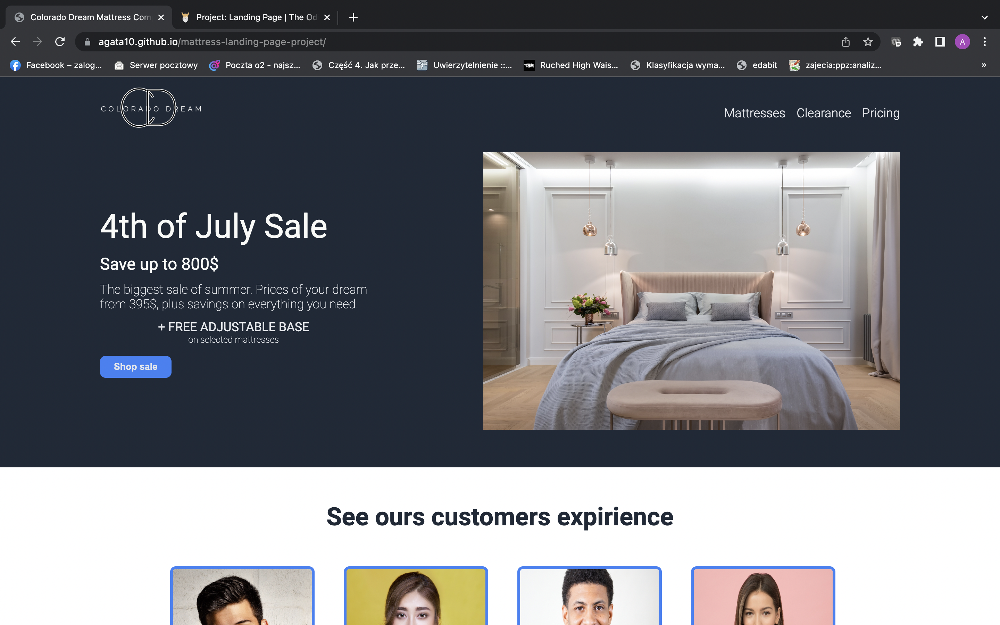
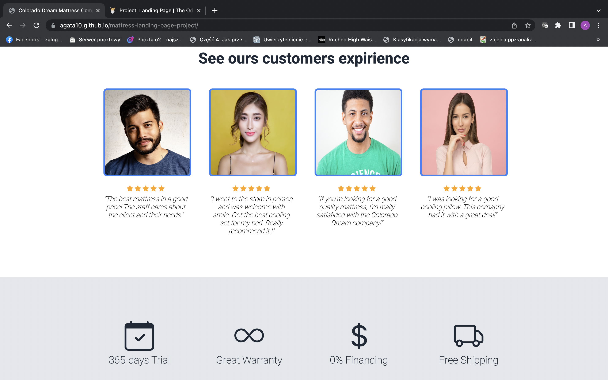
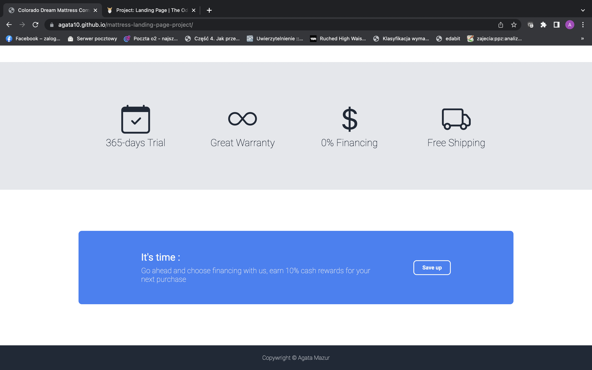

# My first landing page build from scratch for mattress company

## Table of Contents
* [General Info](#general-information)
* [Technologies](#technologies)
* [Screenshots](#screenshots)
* [Link to webpage](#link-to-webpage)
* [Setup](#setup)
* [Usage](#usage)

## General information
It's my frist landing page using HTML and CSS. It's a business webpage for mattress company. Landing page is one of the task from [The Odin Project](https://www.theodinproject.com/lessons/foundations-landing-page) .

## Technologies
* CSS3
* HTML5

## Screenshots

## Link to webpage
https://agata10.github.io/mattress-landing-page-project/

## Setup

1. Fork repository 
or
2. Clone reposiory
   `git clone https://github.com/YOUR-USERNAME/YOUR-REPOSITORY`

## Usage

This is basic landing page where I wanted to practice working with flexbox feature. It's simply in design, logo of the company was create also by myslef.
